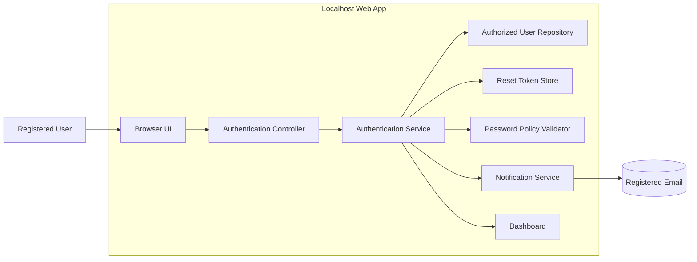

# SCRUM-50 Architecture

> Artifact status: retained as the approved architecture after the final passing phase 8 rerun.
> PR scope note: touched so this artifact appears in PR #4 with the latest full-suite stabilization refresh.

## Overview
SCRUM-50 requires a localhost web application that supports secure user login and password recovery. The architecture should focus on a small, practical authentication flow with clear validation, account lockout, reset-token lifecycle handling, and a post-login dashboard redirect. Because the requirements only describe authentication and recovery behavior, the design should stay narrow and avoid unrelated platform complexity.

The recommended approach is a layered web application with a browser UI, an authentication controller, an application/service layer for login and reset rules, and a persistence layer for users, lockout state, and reset tokens. This keeps the login and recovery rules testable and traceable to the story requirements.

## Architecture Recommendation
Use a standard layered localhost web application architecture:

1. Presentation layer for login, forgot-password, reset-password, and dashboard screens.
2. Controller layer to receive form submissions and route requests.
3. Authentication service layer to enforce all business rules for credentials, lockout timing, reset token creation, token expiry, and password strength.
4. Data access layer for the authorized user repository and token/lockout storage.
5. Notification abstraction to simulate or dispatch the reset link to the registered email address.

This architecture fits the requirements because the story is centered on stateful security behavior rather than broad domain workflows. It also supports deterministic testing of mandatory-field validation, invalid login denial, 2-attempt lockout, 60-second unlock, one active token per user, 60-second token expiry, and strong-password enforcement.

## Key Components and Responsibilities

### Presentation Layer
- Login page accepts username and password.
- Forgot-password page accepts registered username or email.
- Reset-password page accepts reset token and new password.
- Dashboard page is the post-login destination.
- Displays validation errors for mandatory fields, invalid credentials, expired tokens, and password policy failures.

### Authentication Controller
- Accepts form submissions from the UI.
- Routes login, forgot-password, and reset-password requests to the service layer.
- Returns success or error responses for the UI to render.

### Authentication Service
- Validates mandatory login fields.
- Authenticates against the authorized user repository.
- Denies invalid credentials.
- Tracks failed login attempts and locks accounts after 2 failures.
- Prevents access while an account is locked and releases the lock automatically after 60 seconds.
- Locates a registered user by username or email for password recovery.
- Generates password reset tokens.
- Enforces a single active reset token per user.
- Checks reset-token expiry at 60 seconds.
- Validates new passwords against the strength policy: minimum 8 characters, at least one uppercase letter, one lowercase letter, one digit, and one special character.
- Invalidates previous reset tokens after a successful reset.

### User Repository
- Stores authorized user records used for login.
- Stores account state needed for lockout checks.
- Provides lookup by username and email for recovery requests.

### Reset Token Store
- Persists the active reset token for each user.
- Stores token creation time and expiry time.
- Marks prior tokens inactive when a new token is created or when reset succeeds.

### Notification Service
- Sends the reset link to the registered email address.
- Keeps email delivery behind an abstraction so the localhost app can use a stub or local mail capture during testing.

### Password Policy Validator
- Enforces the reset password complexity rules.
- Keeps policy checks isolated so the rules are testable and reusable.

## Security and Operational Decisions
- Store user passwords as salted, one-way hashes; never persist plaintext passwords or expose them in logs.
- Generate reset tokens as high-entropy, single-use secrets and transmit them only through the reset link.
- Treat login, lockout, reset-token issuance, reset-token expiry, and password-reset success or failure as auditable events.
- Keep reset links and authentication responses free of sensitive account details so the UI does not reveal whether a user exists beyond the allowed recovery behavior.
- Apply standard browser protections for form submissions, including session-safe redirects and CSRF protection where the web stack requires it.
- Keep authentication state, lockout state, and token state centralized so the rules remain testable and consistent across requests.

## Data Flow
### Login Flow
1. The user submits username and password from the login page.
2. The controller forwards the request to the authentication service.
3. The service validates required fields.
4. The service checks whether the account is locked.
5. The service authenticates the credentials against the user repository.
6. On failure, the service increments the failed-attempt count and locks the account after the second failure.
7. On success, the service clears failed-attempt state and redirects the user to the dashboard.

### Forgot-Password Flow
1. The user submits a registered username or email.
2. The controller forwards the request to the authentication service.
3. The service resolves the user from the repository.
4. The service creates a single active reset token for that user and stores its 60-second expiry.
5. The notification service sends the reset link to the registered email address.

### Reset-Password Flow
1. The user opens the reset link and submits the token with a new password.
2. The controller forwards the request to the authentication service.
3. The service verifies that the token is active and not expired.
4. The service validates the new password against the strength policy.
5. On success, the service updates the password, invalidates previous tokens, and clears the active token state.

## Component Diagram

## Traceability Notes
- Mandatory login validation maps to the login field requirements and AC-003.
- Invalid credential denial maps to the login failure requirements and AC-002.
- Account lockout after 2 failures and unlock after 60 seconds map to the lockout business rules and AC-010 to AC-011.
- Username/email-based forgot-password initiation maps to AC-004.
- Reset link delivery to the registered email maps to AC-005.
- One active token, 60-second token expiry, and token invalidation map to the reset-token rules and AC-006 to AC-008.
- Strong password enforcement maps to AC-007.
- Successful login redirect to the dashboard maps to AC-001.

## Assumptions
- The localhost app uses a persistent store or in-memory test store that can track failed attempts, lockout timestamps, and reset-token state.
- Email sending can be implemented through a local mail stub or a pluggable notification adapter, since the story only requires that the reset link be sent to the registered email address.
- The missing BR-001 to BR-009 and AC-001 to AC-012 details are interpreted only from the requirements text provided in SCRUM-50.